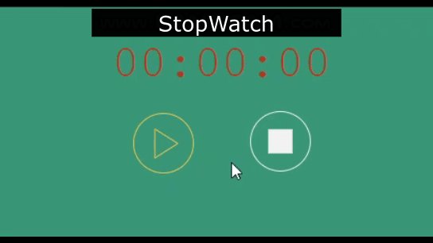

Clarusway

 

# JS-CC-013: Stopwatch

## Assignment Statement

- Time to put your newly learned skills to work!

- Prepare a web page include functional stopwatch.

## Submit

- Students will push the solutions to their own public GitHub repos.

## Learning Outcomes

At the end of the this coding challenge, students will be able to;

- Analyze a problem, identify and apply programming knowledge for appropriate solution.

- Demonstrate their knowledge of algorithmic design principles by using JavaScript and Python effectively.

## Expected Outcome

## Problem Statement

- Create a web page
  - Write html code
  - Add Css to your web site

-Write javaScript code
  - Make a functional stopwatch.

 ⌛ Happy Coding  ✍ 

